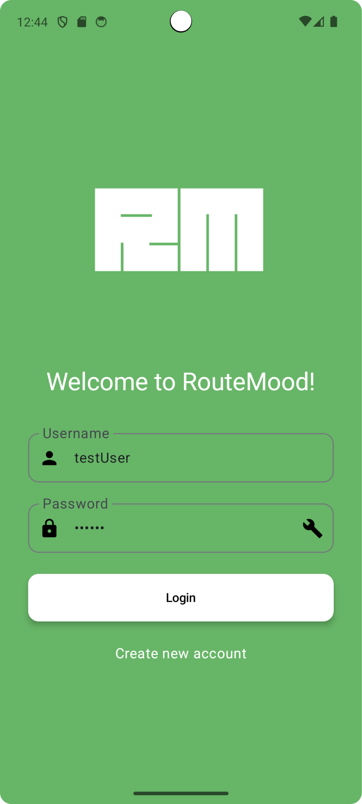
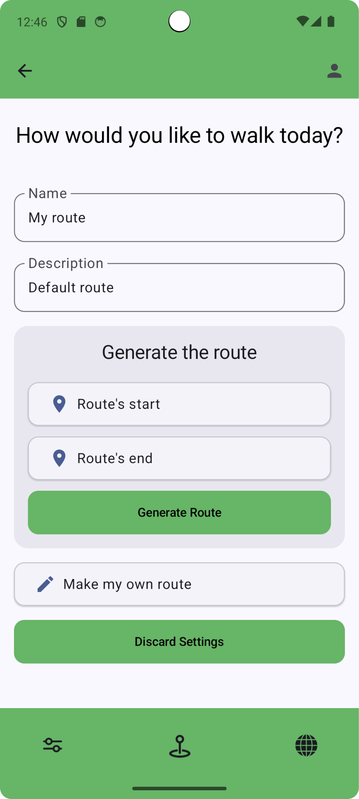
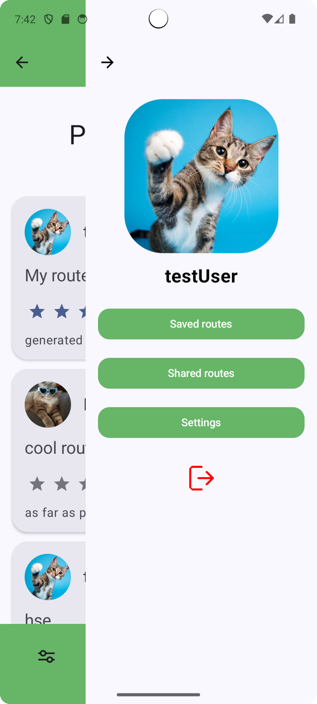
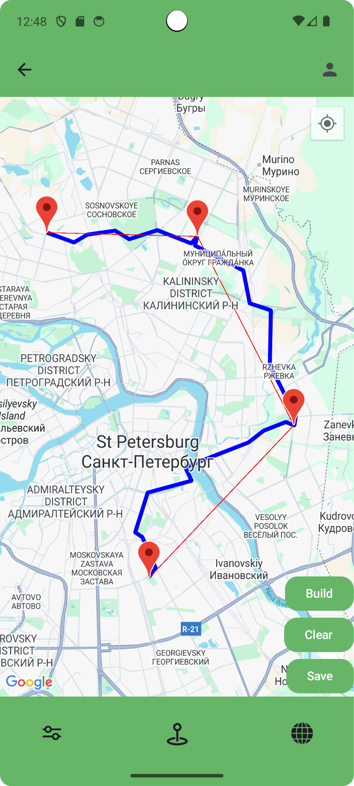
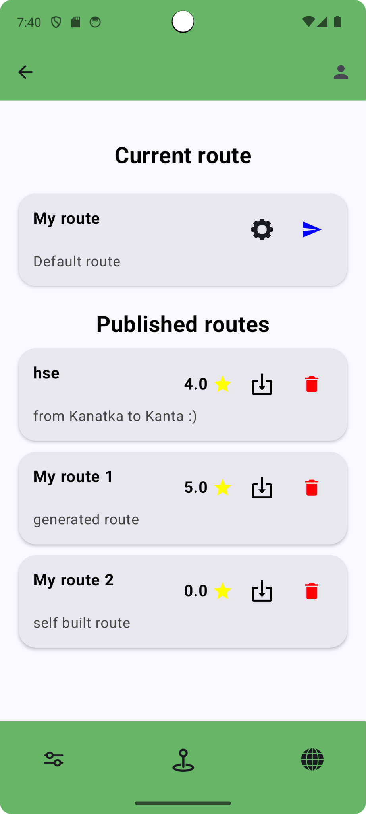
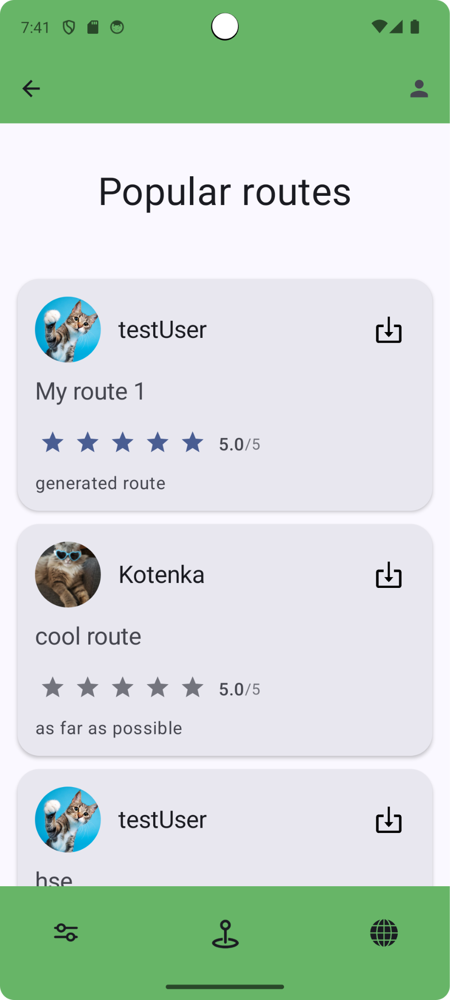

# RouteMood - Генератор маршрутов для Android

[](LICENSE)

## Содержание
- [Описание](#описание)
- [Возможности](#возможности)
- [Скриншоты](#скриншоты)
- [Технологии](#технологии)
- [Установка и запуск](#установка-и-запуск)
- [Лицензия](#лицензия)

## Описание
Android-приложение для создания и оценки пеших маршрутов. Позволяет генерировать маршруты с помощью YandexGPT или создавать их вручную на карте.

## Возможности
✔ Генерация маршрутов через YandexGPT  
✔ Ручное создание маршрутов на карте  
✔ Сохранение маршрутов локально (Room Database)  
✔ Обмен маршрутами с другими пользователями  
✔ Рейтинговая система (1-5 звёзд)  
✔ Пользовательские аватары (Datastore + сервер)  
✔ Воспроизведение видео при генерации маршрута  

## Скриншоты
| Экран входа | Настройки маршрута | Профиль |
|-------------|-------------------|---------|
|  |  |  |

| Создание маршрута | Опубликованные маршруты | Рейтинг |
|-------------------|------------------|---------|
|  |  |  |

## Технологии
- Язык: Kotlin, Jetpack Compose
- Карты: Google Maps SDK
- Локальное хранилище: Room Database, DataStore
- Сетевое взаимодействие: Retrofit
- Генерация маршрутов: YandexGPT API
- Архитектура: MVVM

## Установка и запуск
1. Установите [Android Studio](https://developer.android.com/studio)
2. Клонируйте репозиторий:
   ```bash
   git clone https://github.com/RouteMood/RouteMoodClient.git
3. Откройте проект в Android Studio

4. Добавьте API ключи:

Создайте файл local.default.properties в корне проекта
```properties
# Ключ для Google Maps SDK
MAPS_API_KEY=your_google_maps_key

# Ключ для Google Directions API
MAPS_SERVER_API_KEY=your_directions_api_key
```
# Лицензия
MIT License. Подробнее см. в файле LICENSE.
    